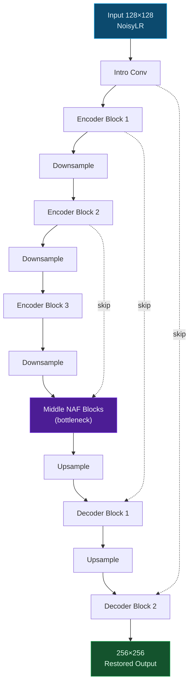
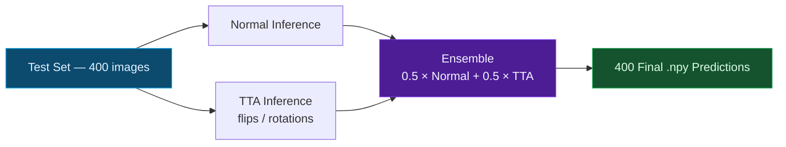

<div align="center">

# KLA — AI-Based Restoration of Degraded Semiconductor Images

### SEMICON India Hackathon 2026 · Team WAYAN-X

*Reconstructing 256×256 high-fidelity semiconductor inspection images from 128×128 noisy, low-resolution scans*


</div>

---

## Why this problem is hard

Semiconductor inspection systems capture wafer imagery under tight throughput constraints, which means sensors often trade resolution and exposure time for speed. The result is imagery that is simultaneously **noisy** and **under-resolved** — exactly the combination that breaks classical restoration techniques.

Naive upsampling (bicubic, Lanczos) can hallucinate smoothness where sharp edges should exist, or amplify sensor noise into visible artifacts. Neither failure mode is acceptable when the downstream task is defect detection on circuit structures a few pixels wide. What's needed is a model that has actually *learned* the mapping from degraded observations to clean ground truth, rather than one that interpolates blindly.

That's the problem KLA posed for this hackathon: given a **128×128 NoisyLR** patch, recover a structurally faithful **256×256** reconstruction.

---

## Table of Contents

- [Approach at a Glance](#approach-at-a-glance)
- [Architecture — NAFNet Lite](#architecture--nafnet-lite)
- [Inference Pipeline](#inference-pipeline)
- [Results](#results)
- [Repository Layout](#repository-layout)
- [Getting Started](#getting-started)
- [Data Format](#data-format)
- [What We'd Push Further](#what-wed-push-further)
- [Team](#team)

---

## Approach at a Glance

We deliberately built up in stages rather than jumping straight to the most complex model we could design — mostly because in a time-boxed hackathon, an untraceable failure in a fancy model is worse than a boring, working baseline.

| Stage | What we did | Why |
|---|---|---|
| **1. Baseline** | Trained a compact Tiny CNN | Establishes a measurable floor before adding complexity |
| **2. Main model** | Built a lightweight NAFNet-inspired restorer | Multi-scale context + residual learning for structural fidelity |
| **3. Validation tracking** | Logged L1 / PSNR / SSIM every epoch, checkpointed the best | Lets us pick the actual best model, not just the last one |
| **4. Inference** | Ran normal + test-time-augmented (TTA) passes, then ensembled | Reduces variance from any single transformation |


---

## Architecture — NAFNet Lite

The core model is a scaled-down, encoder-decoder restoration network built in the spirit of **NAFNet** (Nonlinear Activation Free Network), rather than a direct reimplementation of the original paper. We kept what mattered for this dataset size and compute budget, and dropped what didn't.

**Design choices, and the reasoning behind each one:**

- **SimpleGate blocks instead of standard activations** — a gated linear split does the job of an activation function without needing a nonlinearity like GELU, which kept the block cheaper while preserving representational capacity.
- **Depthwise convolutions** — most of the spatial mixing happens per-channel, keeping parameter count low enough to train comfortably on the dataset we had.
- **Group normalization** — more stable than batch norm at the smaller batch sizes a hackathon compute budget forces on you.
- **Encoder-decoder skip connections** — high-frequency detail (edges, fine structures) gets lost by the time you reach the bottleneck; skip connections hand it back to the decoder directly.
- **Residual learning** — the network predicts a *correction* to the input rather than the whole image from scratch, which is an easier function to learn and keeps low-frequency content stable.
- **PixelShuffle upsampling** — sub-pixel convolution for the 128→256 upscale, chosen over transposed convolutions to avoid checkerboard artifacts.



> This is intentionally the *lite* variant — enough NAF blocks per stage to learn the mapping well, without ballooning training time past what a hackathon timeline allows.

---

## Inference Pipeline

Once the best checkpoint is selected on validation, every test image goes through two independent inference passes before being combined:



The intuition here is simple: a single forward pass is sensitive to whatever orientation the input happened to be in. Averaging predictions from flipped/rotated versions of the same input smooths out that sensitivity, at the cost of running inference more than once per image.

---

## Results

Best validation checkpoint from the full 50-epoch training run:

| Metric | Value |
|---|---:|
| **PSNR** | **28.7921 dB** |
| **SSIM** | **0.7709** |
| Validation L1 | 0.028807 |
| Test images processed | 400 |
| Output resolution | 256×256 |

**Baseline vs. final model:**

| Model | PSNR | SSIM | Notes |
|---|---:|---:|---|
| Tiny CNN Baseline | ~27.89 dB | ~0.74 | Reference point, no multi-scale context |
| **NAFNet Lite (ours)** | **28.7921 dB** | **0.7709** | +~0.9 dB PSNR, +0.03 SSIM over baseline |

> These are **validation-set** numbers. We're not reporting test-set PSNR/SSIM because ground truth for the test split wasn't available to us locally — the 400 outputs are submitted as predictions, not self-scored.

---

## Repository Layout

```
KLA-image-restoration/
│
├── configs/
│   ├── dataset.yaml          # dataset paths, split ratios
│   ├── model.yaml            # NAFNet Lite hyperparameters
│   └── train.yaml            # LR schedule, epochs, batch size
│
├── datasets/
│   └── npy_dataset.py        # paired NoisyLR/GT loader
│
├── models/
│   ├── nafnet_lite.py        # main restoration model
│   └── tiny_baseline.py      # baseline CNN
│
├── losses/                   # L1 / structural loss terms
│
├── utils/
│   ├── checkpoint.py         # save/load best & latest
│   ├── metrics.py            # PSNR, SSIM
│   └── seed.py               # reproducibility
│
├── scripts/
│   ├── inspect_dataset.py
│   ├── benchmark_inference.py
│   └── metrics.py
│
├── reports/
│   └── dataset_report.json
│
├── docs/
│   └── ppt_content.md
│
├── train.py
├── inference.py
├── evaluate.py
├── requirements.txt
└── README.md
```

---

## Getting Started

**Clone the repo**

```bash
git clone https://github.com/Shivansh21-pixel/KLA-image-restoration.git
cd KLA-image-restoration
```

**Set up the environment**

```powershell
python -m venv .venv
.\.venv\Scripts\Activate.ps1
pip install -r requirements.txt
```

**Point it at your data** — edit `configs/dataset.yaml` with your local dataset paths.

**Train**

```bash
python train.py
```

**Resume an interrupted run**

```bash
python train.py --resume
```

**Run inference**

```powershell
python inference.py --input_dir "PATH_TO_TEST_NOISYLR" --output_dir "results/final_nafnet" --checkpoint "checkpoints_nafnet/best_model.pth"
```

Checkpoints are written to:

```
checkpoints_nafnet/
├── best_model.pth
└── latest_model.pth
```

---

## Data Format

Paired NumPy arrays, matched by filename:

```
train/
├── NoisyLR/
│   ├── 000000.npy
│   ├── 000001.npy
│   └── ...
│
└── GT/
    ├── 000000.npy
    ├── 000001.npy
    └── ...
```

| Split | Shape |
|---|---|
| NoisyLR | 128×128 |
| GT | 256×256 |

The dataset itself isn't bundled with this repo — only the pipeline that consumes it.

---

## What We'd Push Further

Given more compute and time beyond the hackathon window, the next round of experiments would go toward:

- Combining pixel-level (L1) loss with a structural/perceptual term for sharper edges
- A broader augmentation set — right now we're leaving some robustness on the table
- Scaling up NAFNet Lite's width/depth once training time isn't the bottleneck
- More TTA variants beyond flips/rotations
- Objective test-set scoring once ground truth becomes available
- Tighter experiment tracking (right now it's mostly checkpoint + log files)
- A visual benchmark panel comparing NoisyLR → Restored → GT side by side
- Profiling inference for speed/memory, since production inspection pipelines care about throughput

---

## Team

<div align="center">

### WAYAN-X

**KLA — SEMICON India Hackathon 2026**
AI-Based Restoration of Degraded Images for Semiconductor Inspection

Built with Python, PyTorch, and a healthy amount of trial-and-error.

</div>
