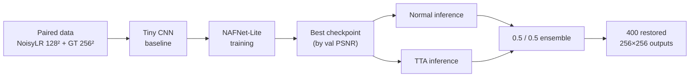
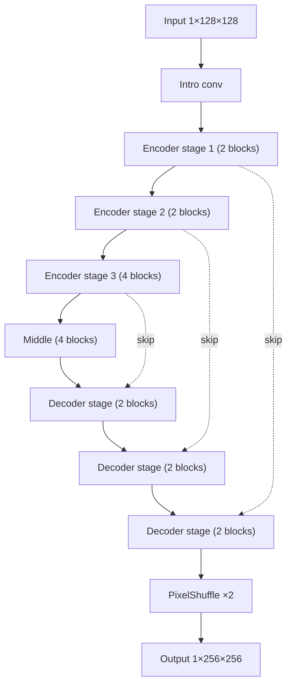

# Semiconductor Image Restoration

A PyTorch project that restores **128×128 noisy, low-resolution grayscale semiconductor images** into **256×256 clean outputs** using a lightweight NAFNet-inspired network I built from scratch.

I wanted to see how far a small, carefully designed model could go on a problem where interpolation alone fails: the input is degraded by noise *and* low resolution at the same time, and the structures that matter (edges, fine patterns, tiny defects) are exactly what naive upscaling smears out.


---

## What it does

| | |
|---|---|
| **Input** | 128×128 grayscale, noisy + low-res (Gaussian / speckle-like noise, downsampled) |
| **Output** | 256×256 grayscale, denoised + 2× upscaled |
| **Model** | NAFNet-Lite — multi-scale encoder-decoder, ~single forward pass |
| **Training** | AdamW, L1 loss, 50 epochs, validation on PSNR / SSIM / L1 |
| **Inference** | Batch inference over 400 unseen images, with optional TTA + ensembling |

Denoising and resolution recovery are learned **jointly in one network** instead of chaining a denoiser and a separate super-resolution model, so errors from one stage don't get amplified by the next.

---

## Results

Best checkpoint, evaluated on the held-out **validation split**:

| Metric | Value |
|---|---:|
| PSNR | **28.7921 dB** |
| SSIM | **0.7709** |
| L1 | 0.028807 |

Baseline comparison (same validation protocol):

| Model | PSNR | SSIM |
|---|---:|---:|
| Tiny CNN baseline | ~27.89 dB | ~0.74 |
| **NAFNet-Lite** | **28.7921 dB** | **0.7709** |

That is roughly **+0.9 dB PSNR and +0.03 SSIM** over the baseline.

> **A note on what these numbers are.** They are validation metrics. The 400 test inputs were restored and saved, but I did not have their ground truth locally, so I don't report test-set PSNR/SSIM and I don't claim TTA or the ensemble improved a metric — only that they were compared as inference-stability experiments (see below).

---

## Pipeline


```mermaid
flowchart LR
    A["Paired data<br/>NoisyLR 128² + GT 256²"] --> B["Tiny CNN<br/>baseline"]
    B --> C["NAFNet-Lite<br/>training"]
    C --> D["Best checkpoint<br/>(by val PSNR)"]
    D --> E["Normal inference"]
    D --> F["TTA inference"]
    E --> G["0.5 / 0.5 ensemble"]
    F --> G
    G --> H["400 restored<br/>256×256 outputs"]
```

## Model

The network is my own lightweight implementation in the spirit of NAFNet (Chen et al., *Simple Baselines for Image Restoration*). It is **not** a port of the official code and I don't claim its benchmark numbers.


```mermaid
flowchart TD
    IN["Input 1×128×128"] --> INTRO["Intro conv"]
    INTRO --> E1["Encoder stage 1 (2 blocks)"]
    E1 --> E2["Encoder stage 2 (2 blocks)"]
    E2 --> E3["Encoder stage 3 (4 blocks)"]
    E3 --> MID["Middle (4 blocks)"]
    MID --> D1["Decoder stage (2 blocks)"]
    D1 --> D2["Decoder stage (2 blocks)"]
    D2 --> D3["Decoder stage (2 blocks)"]
    D3 --> UP["PixelShuffle ×2"]
    UP --> OUT["Output 1×256×256"]
    E1 -. skip .-> D3
    E2 -. skip .-> D2
    E3 -. skip .-> D1
```

**Config:** width 32 · encoder blocks `[2, 2, 4]` · middle blocks 4 · decoder blocks `[2, 2, 2]` · 1 input channel · 1 output channel · scale ×2

**Design choices**

- **SimpleGate** instead of a conventional activation — cheap, and keeps the block simple.
- **Depthwise convolutions + GroupNorm** — low parameter count, and GroupNorm behaves better than BatchNorm at small batch sizes.
- **Skip connections** — carry high-frequency detail (edges, fine structure) past the bottleneck.
- **Residual learning** — the network predicts a correction on top of the input rather than the whole image.
- **PixelShuffle upsampling** — sub-pixel convolution for the 2× step, which avoids the checkerboard artifacts transposed convolutions can introduce.

## Inference experiments

I ran the best checkpoint over all 400 test inputs in three ways and compared the outputs:

| Prediction | Min | Max | Mean |
|---|---:|---:|---:|
| Normal | 0.0131 | 0.9526 | 0.6615 |
| TTA | 0.0183 | 0.9510 | 0.6613 |
| Ensemble (0.5·Normal + 0.5·TTA), example | 0.0158 | 0.9491 | 0.6614 |

Mean absolute difference between normal and TTA predictions: **0.00333**. The two paths agree closely, which is the point of the experiment: the ensemble smooths out sensitivity to a single forward pass. Without test ground truth this is a stability check, not an accuracy claim.

---

## Repository layout

```
├── configs/          dataset.yaml · model.yaml · train.yaml
├── datasets/         npy_dataset.py        # paired NoisyLR / GT loader
├── models/           nafnet_lite.py · tiny_baseline.py
├── losses/
├── utils/            checkpoint.py · metrics.py · seed.py
├── scripts/          inspect_dataset.py · benchmark_inference.py · metrics.py
├── reports/          dataset_report.json
├── train.py          # training + validation + best/latest checkpointing
├── inference.py      # batch inference (+ TTA)
├── evaluate.py
└── requirements.txt
```

## Getting started

```bash
git clone https://github.com/Shivansh21-pixel/semiconductor-image-restoration.git
cd semiconductor-image-restoration

python -m venv .venv
# Windows: .\.venv\Scripts\Activate.ps1   |   Linux/macOS: source .venv/bin/activate
pip install -r requirements.txt
```

Set your local data paths in `configs/dataset.yaml`, then:

```bash
python train.py            # train
python train.py --resume   # resume from the latest checkpoint

python inference.py \
  --input_dir "PATH_TO_NOISYLR" \
  --output_dir "results/final_nafnet" \
  --checkpoint "checkpoints_nafnet/best_model.pth"
```

Checkpoints are saved to `checkpoints_nafnet/` as `best_model.pth` (highest validation PSNR) and `latest_model.pth`.

**Data format** — paired `.npy` arrays matched by filename:

```
train/
├── NoisyLR/  000000.npy, 000001.npy, ...   # 128×128
└── GT/       000000.npy, 000001.npy, ...   # 256×256
```

The dataset is not included in this repo.

---

## Limitations and what I'd do next

- Validation-only evaluation; no test-set score, since ground truth wasn't available to me.
- L1 alone tends to favor smooth outputs. A structural or perceptual loss term is the first thing I'd add to sharpen edges.
- Augmentation is minimal, and the model is small on purpose — I'd scale width/depth once training time isn't the constraint.
- Side-by-side visual panels (input / restored / ground truth) and more systematic experiment tracking.
- Profiling inference speed and memory.

## References

- L. Chen, X. Chu, X. Zhang, J. Sun. *Simple Baselines for Image Restoration* (NAFNet), ECCV 2022.
